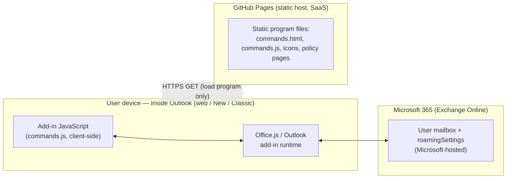
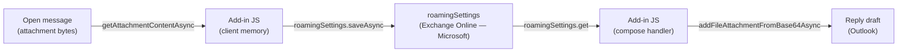

# Microsoft 365 Certification — submission pack

Goal: get **Reply All with Attachments** Microsoft 365 Certified so it can have an
**unrestricted** AppSource listing — i.e., DOT users can self‑install from the
store and the event‑based attach feature works **without** an admin deploying it.

> **Why this is the path:** event‑based add‑ins only auto‑launch on self‑install
> if the listing is *unrestricted*, and unrestricted requires Microsoft 365
> Certification. (If DOT IT would deploy it, none of this would be needed.)

---

## 0. GATE — verify it works first
Do **not** start certification until the rebuilt (v1.1.0.0) event‑based add‑in is
**confirmed working** on the web. Deploy it on your tenant (admin center →
Integrated apps → update with the new manifest), then test on Outlook on the web:
open a message with an attachment → click **Reply All with Attachments** → confirm
the file appears on the reply. Certification analysts test functionality; an
unproven add‑in wastes the cycle.

## 1. Sequence
1. ✅ App built (event‑based, hosted).
2. ⬜ **Verify working on web** (the gate above).
3. ⬜ **List on AppSource** (finish the existing listing + screenshot + pass standard review). Certification sits on top of a live listing.
4. ⬜ **Publisher verification** (verified publisher / PartnerID).
5. ⬜ **Publisher Attestation** (Partner Center questionnaire — answers drafted in §4).
6. ⬜ **Start Certification → Stage 1** (Initial Document Submission, 14 days — docs drafted in §3).
7. ⬜ **Stage 2** (Full Evidence Review, 60 days — analyst Q/A; minimal for us).
8. ⬜ **Awarded** → request **unrestricted listing** ([form](https://aka.ms/AutoLaunchForEndUser)).
9. ⬜ Annual recertification.

## 2. Account actions only you can do
- **Publisher verification:** associate your verified Partner Center PartnerID with the app. (Partner Center → Account settings.)
- **Publisher Attestation & Start Certification:** Partner Center → your offer → compliance.
- **Penetration test:** we have almost no attack surface (static files, no backend). If you don't already run an annual pen test, **Microsoft covers the cost through the certification process** — request it during Stage 1.

---

## 3. Stage‑1 documents (drafts — ready to submit)

### 3.1 App description
Reply All with Attachments is a Microsoft Outlook add‑in (add‑in‑only/XML
manifest, Mailbox requirement set 1.10). It adds one ribbon button on the
message‑read surface. When clicked, it reads the open message's file attachments,
temporarily holds them, opens a standard Reply All, and — via an
`OnNewMessageCompose` event handler — re‑attaches those files to the reply using
`addFileAttachmentFromBase64Async`. This restores attachments that Outlook drops
on Reply All. The add‑in has **no backend, no user accounts, no sign‑in, no
analytics, and no Microsoft Graph usage**. All processing happens client‑side
inside Outlook. Program files are static assets served from GitHub Pages.

### 3.2 Architecture diagram

- **Hosting type:** SaaS (GitHub Pages, a Microsoft subsidiary). No ISV‑operated servers, VMs, databases, or load balancers.
- GitHub Pages serves only static program files; it never receives mail or attachment data.

### 3.3 Data‑flow diagram

- **Microsoft 365 data handled:** message attachment content (may contain EUII/OII), only at the user's explicit click.
- **Where it goes:** entirely within the user's Outlook client and the user's own mailbox storage (`roamingSettings`, hosted by Microsoft/Exchange). The temporary stash is **cleared after the reply is populated** and auto‑expires (60‑second freshness window).
- **What our infrastructure sees:** nothing. GitHub Pages serves static files and receives **no** mail/attachment data. No data is transmitted to the ISV or any third party. No M365 data is stored at rest on ISV infrastructure.
- **Encryption:** in transit via HTTPS (enforced by GitHub Pages); at rest, none on ISV side (roamingSettings is Microsoft‑hosted/encrypted).

### 3.4 Public footprint
- `https://purposebuiltsystems.github.io/reply-all-with-attachments/` and its sub‑paths (commands.html, commands.js, /assets/*, policy pages).
- IP ranges are owned and operated by **GitHub Pages** (not the ISV); the ISV does not run public IPs. Reference GitHub's platform compliance (SOC 2 / ISO 27001).

### 3.5 API endpoints
- **ISV‑hosted API endpoints: none.** The add‑in exposes no web services/APIs and makes no outbound calls to ISV or third‑party services.

### 3.6 Microsoft API permissions & justification
- **Requested permission:** `ReadWriteItem` (Outlook add‑in permission model). **No Microsoft Graph permissions.**
- **Office.js APIs used (Mailbox 1.10):**
  - `item.attachments`, `getAttachmentContentAsync` — read the open message's attachments. *(read)*
  - `displayReplyAllFormAsync` — open a Reply All. *(read)*
  - `addFileAttachmentFromBase64Async` — attach files to the reply being composed. *(write — reason ReadWriteItem is needed)*
  - `roamingSettings` — temporarily carry the attachment bytes from the read context to the compose handler.
  - `notificationMessages` — show a brief in‑message notice (e.g., a skipped oversized file).
  - `Office.actions.associate` — register the button + event handlers.
- **Justification:** the permission is the minimum required to read the current message's attachments and write them onto the *user‑initiated* reply. No access to other messages, folders, contacts, or mailbox‑wide data.

### 3.7 Hosting & infrastructure statement
- **Deployment type:** SaaS (static hosting on GitHub Pages). No IaaS/PaaS/on‑prem, no ISV‑managed compute or storage, no databases, no disaster‑recovery or backup environments holding M365 data.
- Supporting platform compliance is provided by GitHub/Microsoft (SOC 2 Type II, ISO 27001) — to be referenced in lieu of ISV infrastructure controls.

### 3.8 Penetration testing
- Attack surface = static files + client‑side JS; no server‑side endpoints, no auth, no data store. Note this in Stage 1 and request Microsoft‑funded pen testing if you don't already have a report.

---

## 4. Publisher Attestation — drafted answers
(Partner Center questionnaire; phrasing will vary, but these are our truthful answers.)

**Data handling**
- Does the app store/process customer data or M365 data? *Processes attachment content transiently, client‑side and in the user's own mailbox (roamingSettings); **no storage on ISV infrastructure.***
- Does the app transfer data to third parties / subprocessors? *No third parties. Static hosting subprocessor: GitHub (Microsoft subsidiary).*
- Data retention? *None on ISV side; transient stash cleared after use / 60‑second expiry.*
- Encryption in transit / at rest? *In transit: HTTPS. At rest: no ISV storage; roamingSettings encrypted by Microsoft.*
- EUII/OII handling? *Attachment content may contain EUII/OII; never leaves the Microsoft 365 boundary; never received by ISV.*

**Identity & access**
- Authentication method? *None — the add‑in has no sign‑in and no user accounts.*
- Microsoft Graph / Entra permissions? *None.*
- Outlook permission? *ReadWriteItem (minimum for the feature).*

**Security**
- Hosting? *GitHub Pages (static). No ISV‑operated servers.*
- Logging of customer data? *None.*
- Vulnerability management / pen testing? *Minimal surface; will use certification pen testing.*

**Compliance / legal**
- Privacy policy URL: `https://purposebuiltsystems.github.io/reply-all-with-attachments/privacy-policy.html`
- Terms of use URL: `https://purposebuiltsystems.github.io/reply-all-with-attachments/terms.html`
- Support URL: `https://purposebuiltsystems.github.io/reply-all-with-attachments/support.html`
- GDPR/data‑subject requests? *No personal data collected/stored by the ISV, so no ISV‑held data to export/delete.*

---

## 5. Open items / risks
- **New Outlook for Mac** may still not attach (Microsoft bug office‑js #6264); document it as a known platform limitation. DOT's web + Windows users are unaffected.
- The certification framework is built for apps with backends; our zero‑backend design means many controls are **N/A** — be ready to explain the architecture (the diagrams above) so analysts scope it correctly.
- Certification is **annual** — budget for yearly recertification.
